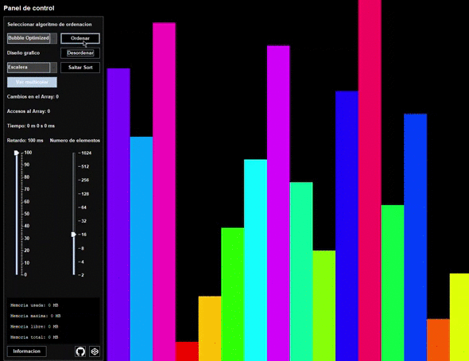
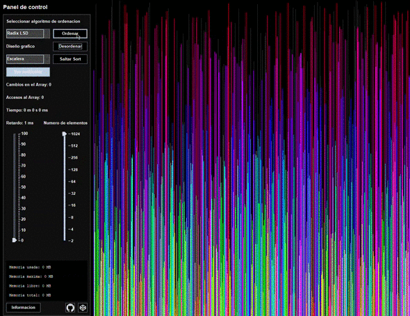

# Ordenacion visual de un Array en Java

Disponibles hasta 20 algoritmos de ordenacion y 6 variantes para el diseño grafico.

La carpeta _data/_ almacena archivos como videos e imagenes que afectan visualmente, no son imprescindibles para el funcionamiento del programa. Para su uso correcto se debe dejar de la misma forma en la que se decarga el repositorio, en una misma carpeta o directorio:

- ordenacionVisual.jar
- data/

## Descarga

```
git clone https://github.com/javiluli/Ordenacion-visual-Java.git
```

---

## Generar ejecutable

```
mkdir -p dist target
javac src/Principal/MainAplicacion.java -sourcepath src -d target/
jar -cvfm dist/ordenacionVisual.jar manifest.mf -C target/ ./
```

---

## Iniciar aplicacion

```
java -jar dist//ordenacionVisual.jar
```

## Disponibles 20 tipos de algoritmos.

- Bitonic sort
- Bubble sort
- Bubble Optimized sort
- Cocktail sort
- Cycle sort
- Gnome sort
- Heap sort
- Insertion sort
- Iterative Quick sort
- Merge sort
- Odd Even sort
- Pancake sort
- Pigeonhole sort
- Quick sort
- Radix sort
- Recursive Bubble sort
- Selection sort
- Shell sort
- Stooge sort
- Tim sort

## Disponibles 6 diseños graficos distintos.

- Escalera
- Piramide horizontal
- Pixel
- Circulo
- Circunferencia
- Espiral

La carpeta _data/_ almacena archivos como videos e imagenes que afectan visualmente, no son necesarios para el funcionamiento del programa. Para su uso correcto se debe dejar de la misma forma en la que se decarga el repositorio, en una misma carpeta o directorio:

- ordenacionVisual.jar
- data/

### Bubble optimized Sort



---

### Merge Sort


---

### Radix LSD Sort



---
