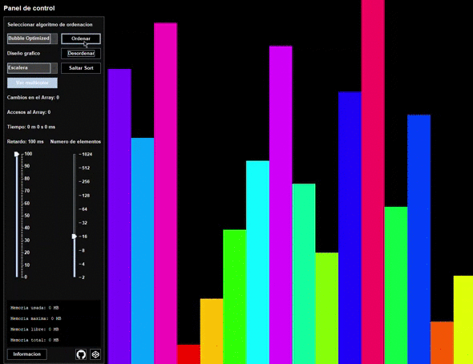
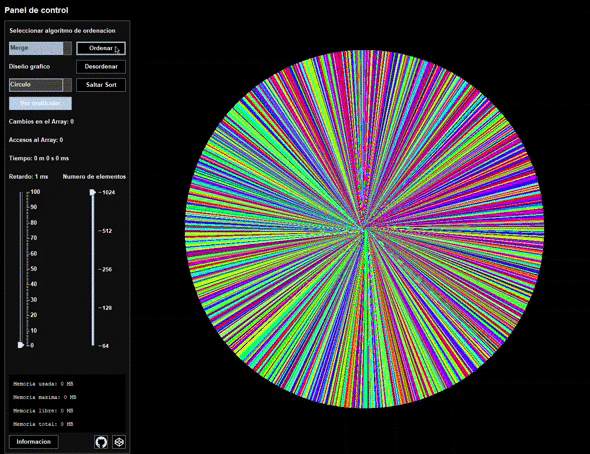
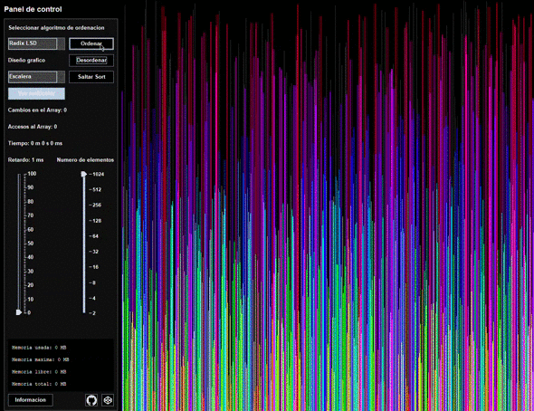

# Ordenación visual de un array en Java

Disponibles hasta 30 algoritmos de ordenación y 8 variantes para el diseño gráfico.

## Descargar y generar ejecutable

```bash
git clone https://github.com/javiluli/array-sort-visualizer.git
cd array-sort-visualizer
mkdir target
javac src/Principal/MainAplicacion.java -sourcepath src -d target/
jar -cvfm program.jar manifest.mf -C target/ ./
```

## Disponibles 30 algoritmos de ordenacion

- Bidirectional Bubble
- Binary insertion sort
- Bitonic sort
- Bogo sort
- [Bubble sort](https://youtu.be/XaJzmQhKbsM)
- [Optimized bubble sort](https://youtu.be/M5o90Ca8kqM)
- Bucket sort
- [Cocktail sort](https://youtu.be/x_2L2QLYZR4)
- [Cycle sort](https://youtu.be/v_hKwLFV5Ck)
- DoubleSelection
- [Gnome sort](https://youtu.be/JnEOrhdxe1w)
- Gravity sort
- [Heap sort](https://youtu.be/IYgJceePT5w)
- [Insertion sort](https://youtu.be/Hfh56tGWVV4)
- Intro sort
- Iterative Merge sort
- Iterative Quick sort
- Merge sort
- Odd Even sort
- Pancake sort
- Pigeonhole sort
- Quick sort
- Radix sort
- Recursive Bubble sort
- Recursive Insertion sort
- Recursive Selection sort
- Selection sort
- Shell sort
- Stooge sort
- Tim sort

## Disponibles 8 diseños gráficos distintos

- Barras clásicas
- Pirámide horizontal
- Pirámide vertical
- Pantalla completa
- Pixel
- Círculo con barras
- Circunferencia
- Espiral con barras

### Bubble optimized Sort



### Merge Sort



### Radix LSD Sort


