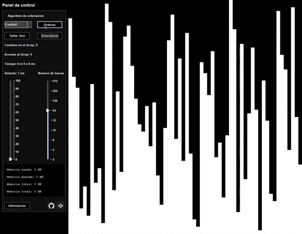
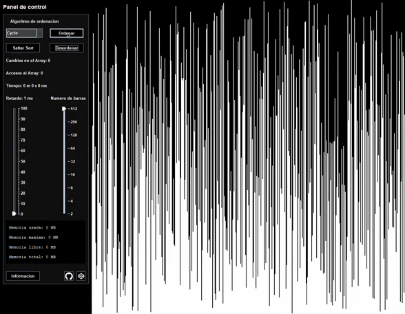
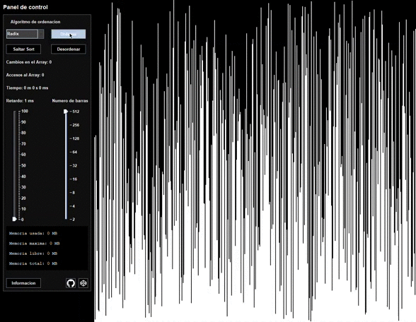

# Ordenacion visual en Java

Aplicacion a nivel basico para visualizar de forma grafica la ordenacion de un Array con diferentes algoritmos.

La carpeta _data/_ almacena archivos como videos e imagenes que afectan visualmente, no son imprescindibles para el funcionamiento del programa. Para su uso correcto se debe dejar de la misma forma en la que se decarga el repositorio, en una misma carpeta o directorio:

- ordenaciones.jar
- data/

## Algoritmos utilizados.

- Burbuja
- Cocktail
- Cycle
- Gnome
- Heap
- Insercion
- Merge
- Odd Even
- Pancake
- Pigeonhole
- Quicksort
- Radix
- Seleccion

### Cocktail Sort

---

### Cycle Sort

---

### Ratrix Sort

---
