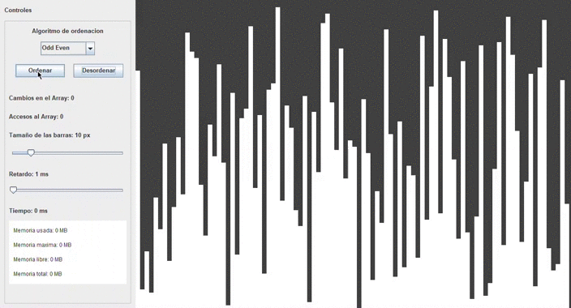
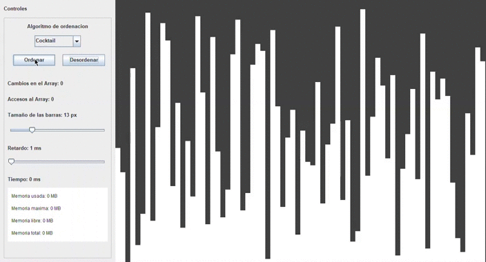
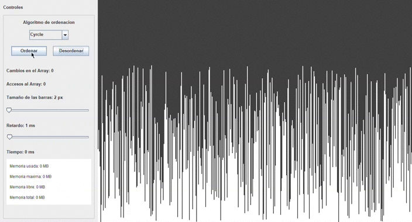

# Ordenacion visual en Java

Aplicacion a nibel basico para visualizar de forma grafica la ordenacion de un Array con diferentes algoritmos.

La carpeta DATA almacena archivos como videos y imagenes que afectan visualmente, no sin inprescindible para el funcionamiento del programa. Para su funcion se debe dejar de la misma forma en la que se decarga el repositorio, en una misma carpeta o directorio:

- ordenaciones.jar
- data/

## Algoritmos utilizados

- Burbuja
- Cocktail
- Cycle
- Gnome
- Heap
- Insercion
- Merge
- Odd Even
- Pancake
- Pigeonhole
- Quicksort
- Radix
- Seleccion

Muestras del programa.

